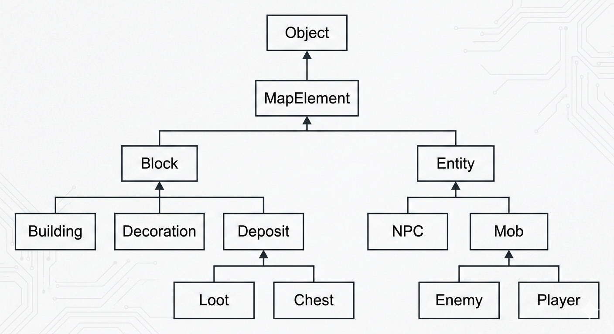

# OOP task for 2nd semester C++ course
#### 🌳 Иерархия классов
````
Object
├── MapElement
│   ├── Block
│   │   ├── Building
│   │   ├── Decoration
│   │   └── Deposit
│   │       ├── Loot
│   │       └── Chest
│   ├── Entity
│   │   ├── NPC
│   │   ├── Mob
│   │   │   ├── Enemy
│   │   │   └── Player
````
#### 📊 Диаграмма
